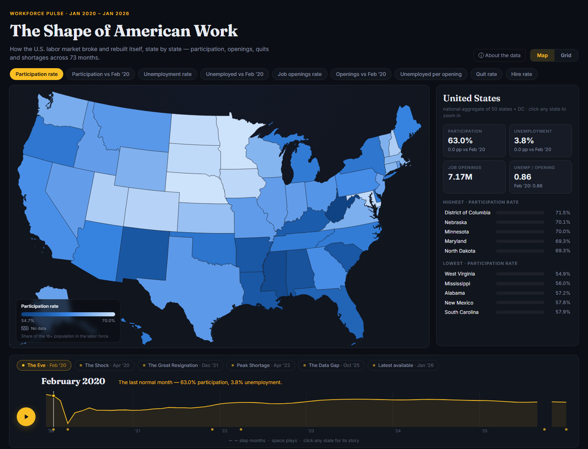

# The Shape of American Work

An interactive atlas of the U.S. labor market using a fixed dataset snapshot from
January 2020 through January 2026. It reads `State-Grid view.csv` directly
(51 jurisdictions × 73 months × 17 indicators). The app does not fetch live data.

**▶ Live demo:** https://efkopru.github.io/workforce-participation/



## Run it

**Double-click `start-app.cmd`** — it starts a tiny dependency-free Node
server ([serve.mjs](serve.mjs)) and opens the app in your browser.
Close its console window to stop the app.

Any other static server works just as well:

- `node serve.mjs` in this folder → http://localhost:8123/
- `python -m http.server` → http://localhost:8000/
- VS Code's *Live Server* **extension** (not built in — install it from the
  Extensions panel first): right-click `index.html` → *Open with Live Server*

A server is required because the app fetches the CSV and its ES modules at
load, and browsers block both on `file://` pages (opening `index.html`
directly shows instructions instead of a blank page). No build step, no
dependencies to install — **editing the CSV and refreshing the page is all
it takes to update the data.**

Browser code uses versioned URLs for the entry module and recently changed
imports. When updating those modules, bump their query versions and the entry
version in `index.html` so cached JavaScript does not outlive the new page.

## What you can do

- **Press play** (or space) and watch six years sweep across the map: the COVID
  shock, the Great Resignation, the labor-shortage era, the recovery.
- **Scrub the timeline** — it doubles as a chart of the national trend for the
  selected metric, so spikes show you where to look.
- **Story chapters** — buttons computed *from the data*: peak national
  unemployment, peak quit rate, the tightest unemployed-per-opening ratio,
  the Oct 2025 data gap, and the latest available month in the snapshot.
- **Two map projections** — geographic (Albers) and an equal-size tile grid.
- **Click any state** for sparklines vs. the national average, a live rank
  chip, and its line overlaid on the timeline.
- **Share what you see** — the URL hash tracks your view, e.g.
  `#m=ur&t=2020-04&s=Michigan` (metric · month · state · `&v=grid` for grid view).
- `←`/`→` step months, `Esc` clears the selection. Honors `prefers-reduced-motion`.

## Architecture

One-way data flow: components call **actions**, actions patch the **store**,
the store notifies components with the set of changed keys, and each
component re-renders only what it owns.

```
js/
├─ main.js                boot: load data → store → actions → components
├─ config.js              metric catalogue, state/tile info, formatters
├─ data.js                CSV fetch + parse → national aggregates, color
│                         scales, story chapters (pure data, no DOM)
├─ store.js               ~20-line observable store (shallow-diffed patches)
├─ actions.js             every state transition: seek/play/select/…
├─ permalink.js           URL-hash ⇄ store sync (shareable views)
├─ ui.js                  toast, modal, load-error screen
└─ components/            each subscribes to the store and owns its DOM
   ├─ map.js              geo + tile-grid layers, legend, map note
   ├─ timeline.js         trend-chart scrubber, play button, caption
   ├─ panel.js            national stats / state detail + sparklines
   ├─ chapters.js         story-chapter buttons
   ├─ metricBar.js        metric pills
   ├─ viewToggle.js       map/grid switch
   └─ tooltip.js          hover card
```

## Metrics

| Metric | Notes |
|---|---|
| Participation rate (LFPR) | share of 16+ population in the labor force |
| Participation vs Feb ’20 | percentage points vs the pre-pandemic baseline |
| Unemployment rate | |
| Unemployed vs Feb ’20 | % change in the *number* unemployed |
| Job openings rate | openings ÷ (employment + openings), the JOLTS definition |
| Openings vs Feb ’20 | % change in openings |
| Unemployed per opening | the dataset's "Available Worker Ratio" — **below 1.0 = labor shortage** |
| Quit rate / Hire rate | share of employment (JOLTS) |

Color scales are fixed across all 73 months (clamped at the 2nd–98th
percentile), so colors stay comparable while animating. Every level metric
uses one blue ramp (brighter = higher). Change metrics diverge from a dark
gray midpoint at the Feb 2020 baseline (1.0 for unemployed per opening):
red below it and blue above it, reversed for "Unemployed vs Feb ’20" so a
rise in unemployment reads red. Missing months are hatched rather than colored.

## Data notes

- Baseline for all "vs pre-pandemic" deltas is **February 2020**; delta series
  begin March 2020.
- **October 2025 observations are missing** for all 51 jurisdictions in the
  supplied snapshot. The map and trend lines show this gap without interpolation.
- Counts are in thousands, seasonally adjusted. National figures are
  recomputed from state sums (rates re-derived, not averaged).
